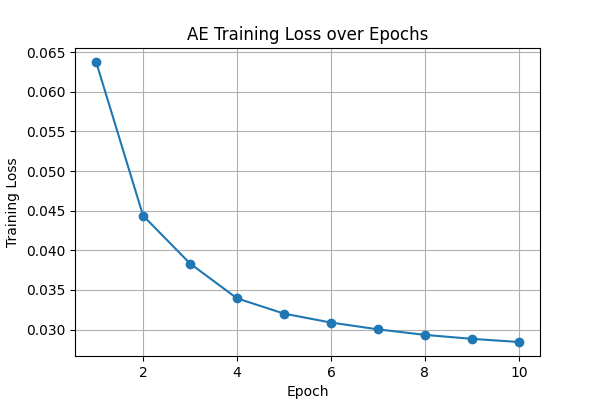
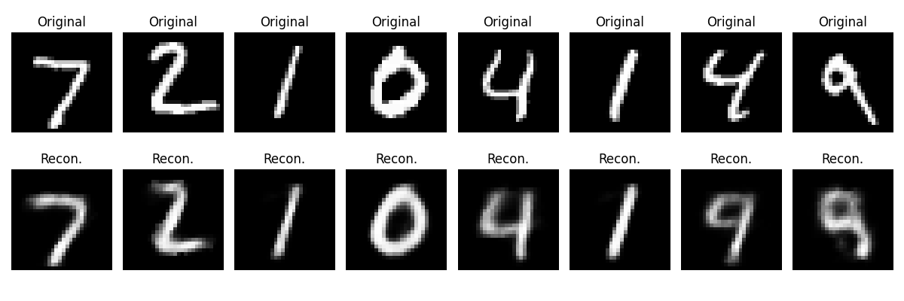
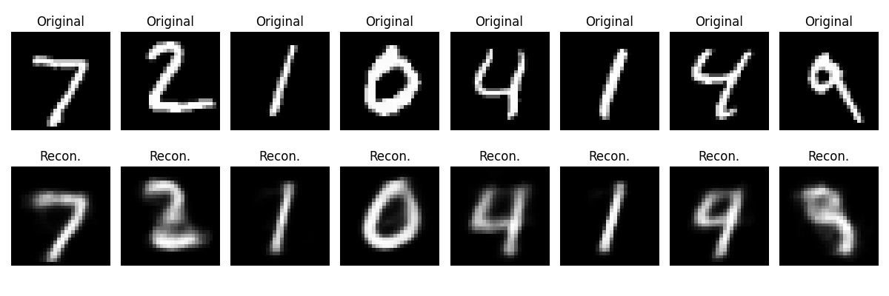
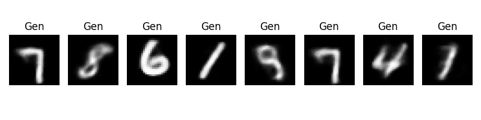
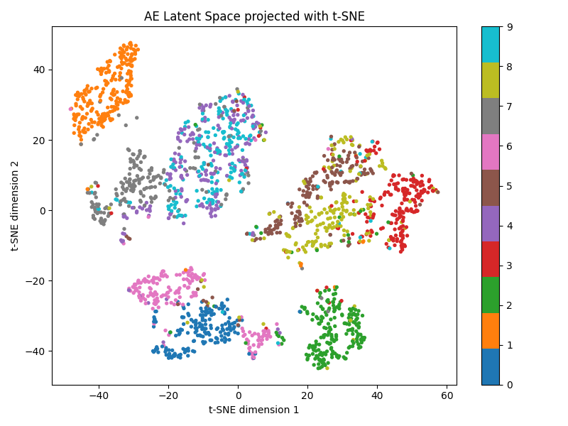
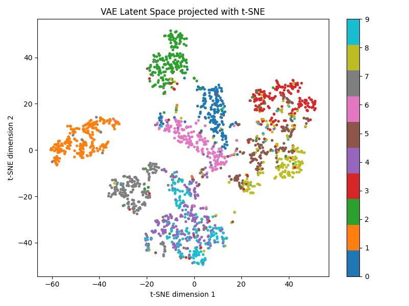

# Autoencoders on MNIST

This project explores unsupervised representation learning with a standard Autoencoder (AE) and a Variational Autoencoder (VAE), both trained on MNIST with PyTorch. The AE focuses on reconstruction, while the VAE adds a probabilistic latent space that can be sampled to generate new digits.

## What it demonstrates

- Learning compact latent representations without digit labels
- Reconstructing images with an Autoencoder
- Structuring a probabilistic latent space with a VAE
- Generating new digit-like images by sampling from the VAE
- Comparing latent spaces with t-SNE

The AE produced sharper reconstructions, while the VAE produced smoother, more continuous latent representations and supported generation from sampled latent vectors. The recorded VAE loss decreased from `6386.19` to `4077.53` over 10 epochs. The t-SNE plots make the difference between the learned latent spaces visible, although t-SNE is used for visualization rather than as a quantitative representation metric.

## Results



| Output | File |
| --- | --- |
| AE reconstructions | `ae_reconstructions.png` |
| VAE reconstructions | `vae_reconstructions.png` |
| VAE generated samples | `vae_generated.png` |
| AE latent space | `ae_latent_tsne.png` |
| VAE latent space | `vae_latent_tsne.png` |

## Visual results











These figures show reconstruction quality, generated samples, and the latent-space structure learned by each model.

## Run

```bash
python -m venv .venv
# Windows
.venv\Scripts\activate
# macOS/Linux: source .venv/bin/activate
pip install -r requirements.txt
python representation_learning.py
```

MNIST is downloaded to `data/` on first use. Generated figures are written in the project directory.
